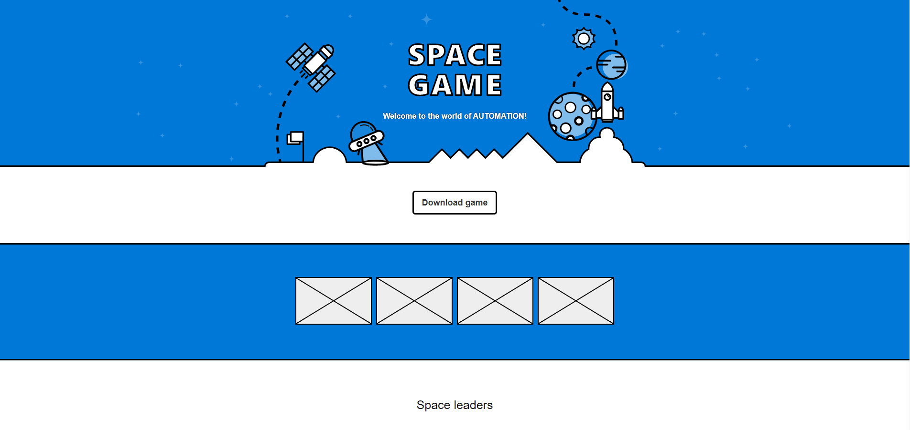

# Technical details for TailspinSpace Game

## 🧪 Code Quality

| Tool | Status |
|------|--------|
| Codacy |  |
| SonarCloud Quality Gate |  |

### ⚙️ CI / Build Pipelines

| Workflow | Status |
|----------|--------|
| Lint Code Base |  |
| Spacegame.Web dotnet |  |
| Spacegame.Web Docker |  |

### 🚀 Deployment

| Platform | Status |
|----------|--------|
| Azure App Service |  |

## Overview

Tailspin Toys, or Tailspin for short, is a video game company. Tailspin hosts its game servers and websites in an on-premises data-center. The company just celebrated the release of a new racing game. They'll be releasing a space shooter game, called Space Game, in the coming months.

The team builds websites to support new game titles. These websites provide information about the game, ways to get it, and leader-boards that show top scores. Each website must go live the same day the game is released.

The Space Game website is a .NET Core app written in C# that's deployed to Linux. The website isn't finished yet, but here's what it looks like right now:

